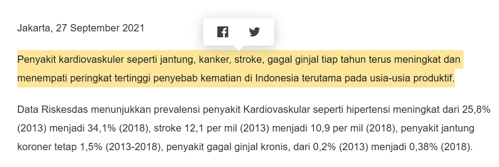
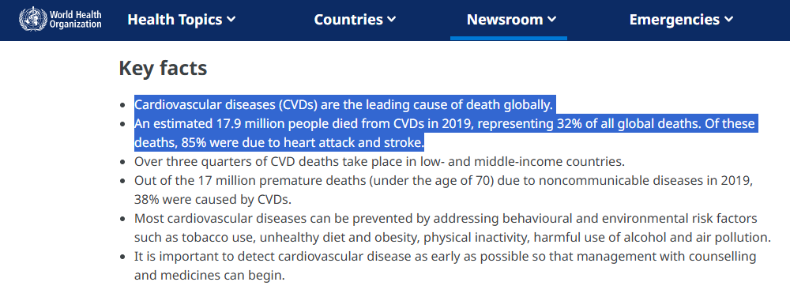
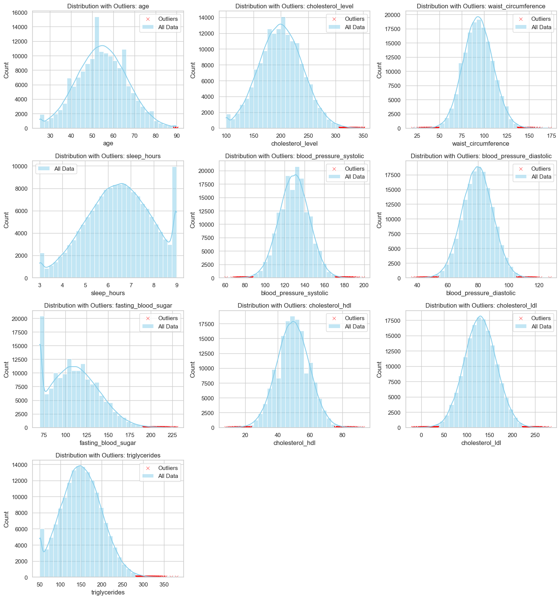
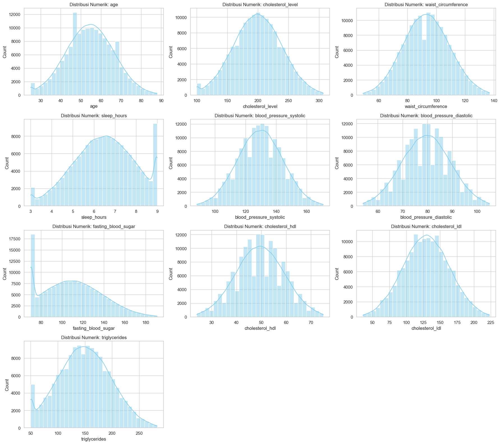
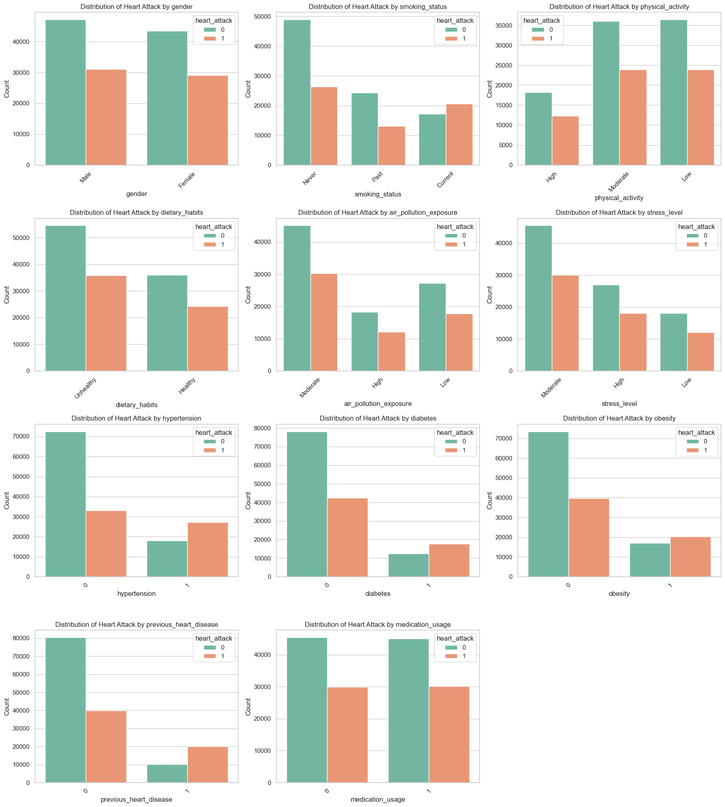
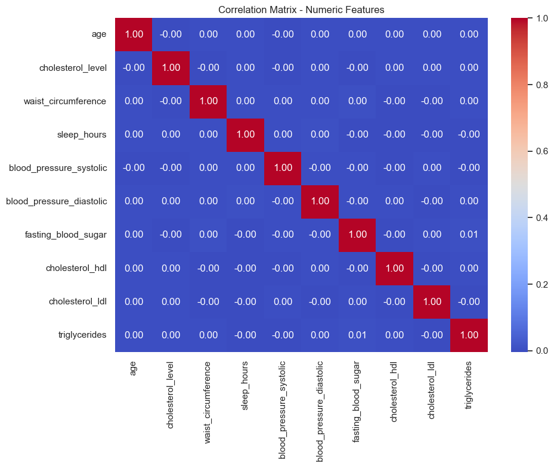
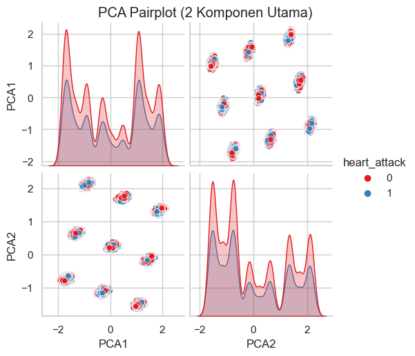

# Laporan Proyek Machine Learning - Muhammad Rizky Asyam Haidar

## Domain Proyek : Kesehatan (Penyakit Jantung)

Penyakit jantung merupakan penyebab kematian tertinggi di Indonesia. Salah satu bentuk serius dari penyakit ini adalah serangan jantung (heart attack), yang sering kali tidak terdeteksi sejak dini. Dalam konteks layanan kesehatan masyarakat, kemampuan untuk memprediksi risiko serangan jantung berdasarkan data medis dan gaya hidup dapat memberikan intervensi lebih awal dan mengurangi angka kematian.

Menurut laporan WHO dan Kementerian Kesehatan RI, faktor risiko seperti hipertensi, kolesterol tinggi, kebiasaan merokok, obesitas, serta gaya hidup tidak sehat sangat berkontribusi terhadap penyakit kardiovaskular.

Model machine learning dalam proyek ini bertujuan untuk membantu menyelesaikan masalah tingginya angka kematian akibat serangan jantung dengan cara menganalisis data medis dan gaya hidup pasien. Dengan mempelajari pola dari data tersebut, model dapat memprediksi kemungkinan seorang individu mengalami serangan jantung. Kemampuan prediksi ini sangat berharga karena memungkinkan identifikasi dini individu berisiko tinggi, sehingga intervensi medis dan perubahan gaya hidup dapat dilakukan lebih awal untuk mencegah terjadinya serangan jantung atau mengurangi dampaknya. Ini berpotensi meningkatkan kualitas layanan kesehatan masyarakat dan menurunkan angka kematian akibat penyakit ini.

## Referensi:
- Kementerian Kesehatan RI, "Situasi Penyakit Jantung di Indonesia", 2018.
- WHO, Cardiovascular Diseases (CVDs), 2021.

## Business Understanding

### Problem Statements

- **PS1** Bagaimana cara memprediksi kemungkinan serangan jantung berdasarkan data kesehatan individu?
- **PS2** Algoritma machine learning mana yang paling efektif untuk mengklasifikasikan risiko serangan jantung dalam dataset ini?

### Goals

- **G1** Membangun model prediksi risiko serangan jantung dengan akurasi dan performa metrik yang layak.
- **G2** Membandingkan performa beberapa algoritma machine learning dalam mengklasifikasikan risiko tersebut.

    ### Solution statements
    - Menerapkan empat algoritma klasifikasi: Logistic Regression, Support Vector Machine (SVM), K-Nearest Neighbors (KNN), dan XGBoost.
    - Melakukan balancing pada kelas target menggunakan `class_weight='balanced'` untuk Logistic Regression.
    - Mengevaluasi performa dengan metrik: accuracy, precision, recall, dan F1-score.

## Data Understanding
Pada tahap ini, dilakukan pemahaman mendalam terhadap dataset yang akan digunakan untuk membangun model.

- Tautan Sumber Data: https://www.kaggle.com/datasets/ankushpanday2/heart-attack-prediction-in-indonesia
- Nama Dataset: Heart Attack Prediction in Indonesia
- Informasi Dataset Awal:
   - Jumlah Data: Dataset ini terdiri dari 158.355 sampel (baris).
   - Jumlah Fitur (Kolom): Terdapat 28 kolom, termasuk fitur target.
- Kondisi Data Awal:
   - Missing Values: Berdasarkan pemeriksaan awal pada data yang dimuat, tidak ditemukan nilai yang hilang (missing values) pada dataset.
   - Duplikasi Data: Tidak terdapat duplicate data

### Uraian Seluruh Fitur pada Data :
Dataset ini mencakup berbagai informasi terkait kondisi medis, demografi, dan gaya hidup responden, yang semuanya berpotensi menjadi prediktor serangan jantung.
- **age**: Usia responden (dalam tahun).
- **gender**: Jenis kelamin responden (`Male`/`Female`).
- **region**: Wilayah tempat tinggal responden.
- **income_level**: Tingkat pendapatan responden (`Low`, `Medium`, `High`).
- **hypertension**: Riwayat hipertensi (1 = ya, 0 = tidak).
- **diabetes**: Riwayat diabetes (1 = ya, 0 = tidak).
- **cholesterol_level**: Tingkat kolesterol total (numerik).
- **obesity**: Status obesitas (1 = obesitas, 0 = tidak).
- **waist_circumference**: Lingkar pinggang (dalam cm).
- **family_history**: Riwayat keluarga dengan penyakit jantung (1 = ada, 0 = tidak).
- **smoking_status**: Status merokok (`Never`, `Former`, `Current`).
- **alcohol_consumption**: Konsumsi alkohol (`Yes`/`No`).
- **physical_activity**: Aktivitas fisik reguler (`Yes`/`No`).
- **dietary_habits**: Pola makan sehat (`Healthy`, `Unhealthy`).
- **air_pollution_exposure**: Tingkat paparan polusi udara (`Low`, `Moderate`, `High`).
- **stress_level**: Tingkat stres responden (`Low`, `Moderate`, `High`).
- **sleep_hours**: Rata-rata jam tidur per malam (dalam jam).
- **blood_pressure_systolic**: Tekanan darah sistolik (mmHg).
- **blood_pressure_diastolic**: Tekanan darah diastolik (mmHg).
- **fasting_blood_sugar**: Kadar gula darah puasa (mg/dL).
- **cholesterol_hdl**: Kadar kolesterol HDL (mg/dL).
- **cholesterol_ldl**: Kadar kolesterol LDL (mg/dL).
- **triglycerides**: Kadar trigliserida (mg/dL).
- **EKG_results**: Hasil pemeriksaan EKG (`Normal`, `Abnormal`, `Borderline`).
- **previous_heart_disease**: Riwayat penyakit jantung sebelumnya (1 = ya, 0 = tidak).
- **medication_usage**: Konsumsi obat terkait jantung (1 = ya, 0 = tidak).
- **participated_in_free_screening**: Partisipasi dalam skrining gratis (1 = ya, 0 = tidak).
- **heart_attack**: Target variabel: apakah pernah mengalami serangan jantung (1 = ya, 0 = tidak).

## Exploratory Data Analysis dan Visualisasi Data
- **Missing Values** = Tidak ada missing values (0)
- **Pembagian Data** : Data dibagi menjadi 2 jenis yaitu numeric_features dan categorical_features
- **Deteksi Outliers Numeric Features dengan IQR** : 
   
   - Grafik ini membandingkan distribusi fitur numerik sebelum (warna merah muda) dan sesudah (warna hijau) penghapusan outlier. Penghapusan outlier bertujuan untuk memperbaiki distribusi data dan menghindari pengaruh negatif nilai ekstrem terhadap model.
   - Setelah dilakukan deteksi outliers terdapat beberapa outliers seperti di age >85 sangat ekstrim sehingga terdeteksi outliers. lanjut EDA Univariate

### Exploratory Data Analysis (EDA) Univariate
- **Distribusi Variabel Kategorikal** : 
   
   - **gender** : Distribusi gender relatif seimbang antara pria dan wanita.
   - **smoking_status** : Mayoritas responden adalah yang tidak pernah merokok dan Diikuti oleh perokok saat ini dan mantan perokok.
   - **physical_activity** : Sebagian besar individu memiliki aktivitas fisik sedang dan rendah dan Aktivitas fisik tinggi hanya mencakup sebagian kecil responden.
   - **dietary_habits** : Sebagian besar responden memiliki kebiasaan makan yang tidak sehat.
   - **air_pollution_exposure** : Paparan polusi udara sedang paling dominan, diikuti oleh rendah dan tinggi.
   - **stress_level** : Mayoritas memiliki tingkat stres sedang.dan Tingkat stres rendah dan tinggi lebih sedikit.
   - **hypertension, diabetes, obesity, previous_heart_disease, medication_usage** : Sebagian besar responden tidak memiliki kondisi tersebut (label `0`). dan Rasio yang memiliki kondisi (`1`) relatif kecil, menunjukkan imbalance data.
- **Distribusi Variabel Numerical** : 
   
   - **age** : Distribusi usia menyerupai distribusi normal dengan puncak sekitar usia 60 tahun.
   - **cholesterol_level** : Distribusi simetris dengan puncak di sekitar 200 mg/dL.
   - **waist_circumference** : Bentuk distribusi normal dengan rata-rata sekitar 90–100 cm.
   - **sleep_hours** : Distribusi tidak normal. dan Mayoritas tidur antara 6–8 jam, ada lonjakan pada 9 jam.
   - **blood_pressure_systolic` dan `blood_pressure_diastolic**: Kedua variabel memiliki distribusi mendekati normal. dan Tekanan sistolik rata-rata di sekitar 130 mmHg dan diastolik sekitar 80 mmHg.
   - **fasting_blood_sugar** : Distribusi skewed ke kanan (positif). Konsentrasi utama antara 90–120 mg/dL.
   - **cholesterol_hdl`, `cholesterol_ldl** : Distribusi cenderung normal. HDL sekitar 50 mg/dL, LDL sekitar 130 mg/dL.
   - **triglycerides**
    Distribusi agak skewed ke kanan. dan Nilai trigliserida kebanyakan di bawah 200 mg/dL.

### Exploratory Data Analysis (EDA) Multivariate
- **Distribusi Serangan Jantung Berdasarkan Fitur Kategorikal**
   
   - **Gender**  : Laki-laki memiliki jumlah kasus serangan jantung yang sedikit lebih tinggi dibanding perempuan.   Ini mengindikasikan gender berpotensi menjadi faktor risiko.
   - **Smoking Status**  : Individu yang merokok (current) memiliki proporsi serangan jantung yang lebih tinggi.   Namun, jumlah terbesar berasal dari kelompok tidak merokok (never), mengindikasikan ada faktor lain yang juga berpengaruh.
   - **Physical Activity**  : Tingkat aktivitas tinggi cenderung terkait dengan lebih sedikit kasus serangan jantung.   Sebaliknya, aktivitas rendah memiliki proporsi serangan jantung lebih tinggi.
   - **Dietary Habits**  : Pola makan tidak sehat (Unhealthy) berkorelasi dengan lebih banyak kasus serangan jantung.   Diet sehat (Healthy) tampaknya menjadi faktor protektif.
   - **Air Pollution Exposure**  : Paparan polusi tinggi berkaitan dengan lebih banyak kasus serangan jantung dibanding paparan rendah. 
   - **Stress Level**  : Stres tinggi berhubungan erat dengan frekuensi serangan jantung yang lebih tinggi.  Hal ini menunjukkan pentingnya faktor psikologis.
   - **Hypertension**  : Penderita hipertensi secara signifikan memiliki lebih banyak kasus serangan jantung.
   - **Diabetes**  : Penderita diabetes juga menunjukkan kecenderungan lebih tinggi mengalami serangan jantung.
   - **Obesity** :  Kasus serangan jantung lebih banyak terjadi pada individu dengan obesitas.
   - **Previous Heart Disease** : Riwayat penyakit jantung sebelumnya adalah indikator kuat terhadap serangan jantung berulang.
   - **Medication Usage** : Penggunaan obat memiliki jumlah kasus serangan jantung yang relatif tinggi, menandakan pasien berisiko tinggi sedang diobati.
- **Korelasi Fitur Numeric** :
   
   - Tidak ada korelasi tinggi antar fitur numerik, yang terlihat dari nilai korelasi mendekati 0.
   - Korelasi tertinggi terjadi antara:
      - blood_pressure_systolic dan blood_pressure_diastolic: ~0.5
      - cholesterol_level dan cholesterol_ldl: ~0.4
   - Sebagian besar fitur berdistribusi independen, artinya masing-masing bisa menyumbang informasi unik ke dalam model prediksi.

## Data Preparation
**Mengapa Diperlukan Data Preparation** :
- Kualitas Data Mempengaruhi Hasil Model
- Beberapa algoritma membutuhkan data dalam format numerik dan berskala.
- Menyeimbangkan Data (Handling Imbalance)
- Meningkatkan Performa dan Akurasi Model

**Penghapusan Fitur (Drop)**
Beberapa fitur dihilangkan karena dianggap kurang relevan untuk prediksi serangan jantung dalam konteks model ini, atau karena alasan privasi dan potensi bias. Fitur yang dihapus adalah: 
- region, 
- income_level,
- family_history,
- alcohol_consumption,
- EKG_results, 
- participated_in_free_screening.
Jumlah fitur setelah drop: 22 (termasuk target).

**Pengananan Outliers**
Outlier pada fitur numerik dideteksi menggunakan metode Interquartile Range (IQR). Nilai yang berada di luar rentang (Q1−1.5 timesIQR) hingga (Q3+1.5 timesIQR) diidentifikasi sebagai outlier dan kemudian dihapus dari dataset.

- Tujuan: Menghindari pengaruh negatif nilai ekstrem terhadap performa model dan memperbaiki distribusi data.
- Visualisasi Perbandingan Distribusi: 
   
- Setelah dilakukan penghapusan outliers data sebagai berikut : 
   - **`age`**: Distribusi usia menunjukkan beberapa nilai ekstrem di atas 85 tahun yang dikategorikan sebagai outlier. Setelah dihapus, distribusi menjadi lebih simetris.
  
   - **`cholesterol_level`**, **`cholesterol_hdl`**, **`cholesterol_ldl`**: Masing-masing menunjukkan distribusi mendekati normal, namun memiliki beberapa nilai sangat tinggi. Penghapusan outlier memperhalus kurva distribusi.
  
   - **`waist_circumference`**: Beberapa nilai sangat rendah atau sangat tinggi dikategorikan sebagai outlier. Setelah dihapus, data lebih terkonsentrasi di tengah distribusi.

   - **`sleep_hours`**: Terdapat lonjakan tidak wajar pada jam tidur ekstrem (misalnya > 9 jam). Setelah penghapusan, distribusi menjadi lebih wajar.

   - **`blood_pressure_systolic` & `blood_pressure_diastolic`**: Keduanya menunjukkan distribusi normal dengan sedikit outlier ekstrem di bawah/atas ambang klinis.

   - **`fasting_blood_sugar`**: Menampilkan distribusi skewed kanan, dengan banyak outlier di atas 160 mg/dL. Setelah penghapusan, distribusi menjadi lebih ramping.

   - **`triglycerides`**: Outlier yang sangat tinggi mempengaruhi bentuk distribusi. Setelah dibersihkan, histogram menjadi lebih simetris.

**One Hot Encoding**
| gender_Male | smoking_status_Never | smoking_status_Past | physical_activity_Low | physical_activity_Moderate | dietary_habits_Unhealthy | air_pollution_exposure_Low | air_pollution_exposure_Moderate | stress_level_Low | stress_level_Moderate | hypertension_1 | diabetes_1 | obesity_1 | previous_heart_disease_1 | medication_usage_1 |
|-------------|----------------------|----------------------|------------------------|-----------------------------|--------------------------|----------------------------|-------------------------------|-------------------|------------------------|----------------|-------------|------------|--------------------------|---------------------|
| 1.0         | 1.0                  | 0.0                  | 0.0                    | 0.0                         | 1.0                      | 0.0                        | 1.0                           | 0.0               | 1.0                    | 0.0            | 1.0         | 0.0        | 0.0                      | 0.0                 |
| 0.0         | 0.0                  | 1.0                  | 0.0                    | 1.0                         | 0.0                      | 0.0                        | 0.0                           | 0.0               | 0.0                    | 0.0            | 0.0         | 0.0        | 1.0                      | 0.0                 |
| 0.0         | 0.0                  | 1.0                  | 0.0                    | 1.0                         | 0.0                      | 1.0                        | 0.0                           | 1.0               | 0.0                    | 0.0            | 0.0         | 1.0        | 0.0                      | 1.0                 |
| 1.0         | 1.0                  | 0.0                  | 0.0                    | 1.0                         | 1.0                      | 1.0                        | 0.0                           | 0.0               | 0.0                    | 1.0            | 0.0         | 0.0        | 0.0                      | 1.0                 |
| 1.0         | 0.0                  | 0.0                  | 0.0                    | 1.0                         | 1.0                      | 0.0                        | 0.0                           | 0.0               | 1.0                    | 1.0            | 0.0         | 0.0        | 1.0                      | 0.0                 |

Fitur-fitur kategorikal yang tersisa (gender, smoking_status, physical_activity, dietary_habits, air_pollution_exposure, stress_level, serta fitur biner seperti hypertension, diabetes, obesity, previous_heart_disease, medication_usage) diubah menjadi representasi numerik menggunakan teknik One-Hot Encoding. Parameter drop='first' digunakan untuk menghindari multikolinearitas (dummy variable trap). Ini menghasilkan kolom-kolom biner baru untuk setiap kategori unik dalam fitur asli (dikurangi satu untuk dummy trap).

**Train Data with Scaler** : 
- Fitur kategorikal seperti gender, smoking_status, dll. diubah menjadi numerik dengan teknik One-Hot Encoding, sambil menghindari dummy trap (drop='first').
- Hasil encoding ini kemudian digabung dengan fitur numerik lain seperti age, blood_pressure, dll.
- Seluruh data numerik (gabungan fitur asli dan hasil encoding) diskalakan menggunakan StandardScaler agar semua fitur memiliki mean 0 dan standar deviasi 1.
- Ini penting karena PCA sensitif terhadap skala data.

**PCA** :
- PCA dilakukan pada data hasil scaling, khususnya hanya pada data training.
- Tujuannya adalah mereduksi dimensi data menjadi hanya 2 komponen utama (PCA1 dan PCA2) yang menangkap variansi terbesar dari data asli.
- Hasil transformasi ini membentuk X_pca.

## Modeling
Pada tahap ini, beberapa algoritma machine learning untuk klasifikasi diterapkan dan dilatih menggunakan data yang telah dipersiapkan.

1. Logistic Regression:
- Cara Kerja: Logistic Regression adalah algoritma klasifikasi linier yang memprediksi probabilitas suatu kejadian (dalam kasus ini, serangan jantung) dengan mencocokkan data pada fungsi logit. Model ini mencari hubungan linier antara fitur input dan log-odds dari kelas target.
- Implementasi & Parameter yang Digunakan:
   - Model diinisialisasi menggunakan LogisticRegression().
   - class_weight='balanced': Parameter ini digunakan untuk secara otomatis menyesuaikan bobot kelas berbanding terbalik dengan frekuensi kelas dalam data input. Ini bertujuan untuk menangani ketidakseimbangan kelas dalam variabel target heart_attack.
   - max_iter=500: Menentukan jumlah maksimum iterasi yang diambil oleh solver untuk konvergen.
   - Parameter lain seperti solver, penalty, dan C menggunakan nilai default dari library scikit-learn.

2. Support Vector Machine (SVM):
- Cara Kerja: SVM bekerja dengan mencari hyperplane terbaik dalam ruang N-dimensi (dimana N adalah jumlah fitur) yang secara optimal memisahkan titik-titik data ke dalam kelas-kelas yang berbeda. Tujuannya adalah untuk memaksimalkan margin (jarak) antara titik data terdekat dari setiap kelas (support vectors) ke hyperplane.
- Implementasi & Parameter yang Digunakan:
   - Model diinisialisasi menggunakan SVC().
   - kernel='linear': Menentukan bahwa model akan menggunakan kernel linier. Ini berarti SVM akan mencoba memisahkan data menggunakan garis lurus (dalam 2D) atau hyperplane (dalam dimensi lebih tinggi) tanpa mentransformasi data ke ruang fitur yang lebih tinggi.
   - Parameter lain seperti C (parameter regularisasi) dan gamma menggunakan nilai default dari library scikit-learn.
   - Model dilatih menggunakan X_pca dan y_train.

3. K-Nearest Neighbors (KNN):
- Cara Kerja: KNN adalah algoritma non-parametrik dan instance-based learning. Untuk mengklasifikasikan data baru, KNN mencari K sampel terdekat (tetangga) dari data tersebut dalam data latih berdasarkan metrik jarak tertentu (misalnya, Euclidean distance). Kelas mayoritas di antara K tetangga tersebut kemudian ditetapkan sebagai kelas prediksi untuk data baru.
- Implementasi & Parameter yang Digunakan:
   - Model diinisialisasi menggunakan KNeighborsClassifier().
   - Semua parameter menggunakan nilai default dari library scikit-learn. Ini termasuk:
   - n_neighbors=5: Jumlah tetangga terdekat yang dipertimbangkan.
   - weights='uniform': Semua titik dalam setiap lingkungan diberi bobot yang sama.
   - metric='minkowski' (dengan p=2, yang setara dengan jarak Euclidean).
   - Model dilatih menggunakan X_pca dan y_train.

4. XGBoost Classifier (Extreme Gradient Boosting):
- Cara Kerja: XGBoost adalah implementasi dari algoritma gradient boosting yang sangat efisien dan powerful. Algoritma ini membangun model secara ensemble (gabungan) dari banyak decision tree yang lemah secara sekuensial. Setiap tree baru dibangun untuk memperbaiki kesalahan dari tree sebelumnya. XGBoost menggunakan regularisasi (L1 dan L2) untuk mencegah overfitting dan memiliki banyak optimasi untuk kecepatan dan performa.
- Implementasi & Parameter yang Digunakan:
   - Model diinisialisasi menggunakan XGBClassifier().
   - use_label_encoder=False: Parameter ini digunakan untuk menonaktifkan penggunaan LabelEncoder internal dan menghindari peringatan terkait deprecation.
   - eval_metric='mlogloss': Metrik yang digunakan untuk evaluasi selama proses training jika ada set validasi (atau untuk tujuan internal). 'mlogloss' adalah metrik LogLoss untuk klasifikasi multikelas (juga bekerja untuk biner).
   - Parameter lain yang fundamental seperti n_estimators (jumlah pohon), learning_rate, max_depth (kedalaman maksimum pohon), dll., menggunakan nilai default dari library XGBoost.
   - Model dilatih menggunakan X_pca dan y_train.

## Evaluation
Tahap evaluasi bertujuan untuk mengukur seberapa baik performa model-model yang telah dilatih dalam memprediksi serangan jantung pada data uji.

### Metrik yang Digunakan

- **Accuracy**: Proporsi total prediksi yang benar dari keseluruhan data uji. Formula: (TP+TN)/(TP+TN+FP+FN)
- **Precision (untuk kelas 1 - serangan jantung)**: Dari semua prediksi yang menyatakan pasien mengalami serangan jantung, berapa banyak yang benar-benar mengalami serangan jantung. Penting untuk menghindari false positive yang berlebihan. Formula: TP/(TP+FP)
- **Recall (Sensitivity) (untuk kelas 1 - serangan jantung)**: Dari semua pasien yang sebenarnya mengalami serangan jantung, berapa banyak yang berhasil diprediksi dengan benar oleh model. Ini sangat krusial dalam konteks medis karena kegagalan mendeteksi kasus positif (false negative) bisa berakibat fatal. Formula: TP/(TP+FN)
- **F1-score (untuk kelas 1 - serangan jantung)**: Rata-rata harmonik dari precision dan recall. Memberikan keseimbangan antara kedua metrik tersebut. Formula: 2
times(Precision
timesRecall)/(Precision+Recall)

**Dimana:**
- TP (True Positive): Pasien serangan jantung yang diprediksi serangan jantung.
- TN (True Negative): Pasien tidak serangan jantung yang diprediksi tidak serangan jantung.
- FP (False Positive): Pasien tidak serangan jantung yang diprediksi serangan jantung.
- FN (False Negative): Pasien serangan jantung yang diprediksi tidak serangan jantung.

### Hasil Evaluasi Model

| Model               | Accuracy | Precision (1) | Recall (1) | F1-score (1) |
|---------------------|----------|----------------|------------|--------------|
| Logistic Regression | 0.4862   | 0.40           | 0.58       | 0.48         |
| SVM                 | 0.5990   | 0.00           | 0.00       | 0.00         |
| KNN                 | 0.7110   | 0.67           | 0.55       | 0.60         |
| XGBoost             | 0.6303   | 0.70           | 0.14       | 0.23         |

### Analisis Hasil dan Hubungan dengan Business Understanding:

**Menjawab Problem Statement (PS1 & PS2):**
- **PS1 (Bagaimana cara memprediksi kemungkinan serangan jantung?):** Proyek ini menunjukkan bahwa machine learning dapat digunakan untuk memprediksi kemungkinan serangan jantung dengan menganalisis data kesehatan. Model seperti KNN menunjukkan kemampuan yang cukup baik dalam tugas ini, meskipun akurasinya belum sempurna.
- **PS2 (Algoritma machine learning mana yang paling efektif?):** Berdasarkan metrik evaluasi, K-Nearest Neighbors (KNN) terbukti menjadi algoritma yang paling efektif secara keseluruhan untuk dataset dan konfigurasi ini. KNN memberikan akurasi tertinggi (71.1%) dan F1-score terbaik (0.60) untuk kelas positif, menunjukkan keseimbangan yang relatif baik antara precision (0.67) dan recall (0.55).
   - SVM gagal total dalam mengidentifikasi kasus positif (recall dan precision 0.00 untuk kelas 1), menjadikannya tidak berguna meskipun akurasinya lebih tinggi dari Logistic Regression. Ini kemungkinan disebabkan oleh ketidakseimbangan kelas atau pemilihan parameter/kernel yang kurang tepat.
   - XGBoost, meskipun memiliki precision tertinggi (0.70), memiliki recall yang sangat rendah (0.14), artinya banyak kasus serangan jantung yang terlewatkan.
   - Logistic Regression dengan class_weight='balanced' menunjukkan recall yang lebih baik (0.58) dibandingkan precisionnya (0.40), namun akurasi keseluruhannya paling rendah.
**Mencapai Goals (G1 & G2):**
- G1 (Membangun model prediksi dengan akurasi dan performa metrik yang layak): Model KNN mencapai akurasi 71.1% dan F1-score 0.60 untuk prediksi serangan jantung. Meskipun ini adalah hasil terbaik di antara model yang diuji dan menunjukkan potensi, "layak" dalam konteks medis mungkin memerlukan standar yang lebih tinggi, terutama untuk recall. Ada ruang untuk peningkatan lebih lanjut.
- G2 (Membandingkan performa beberapa algoritma): Tujuan ini tercapai. Empat algoritma berbeda telah diimplementasikan dan dievaluasi, memberikan wawasan tentang kekuatan dan kelemahan masing-masing pada dataset ini.
**Dampak Solution Statements:**
- Menerapkan empat algoritma klasifikasi: Ini sangat berdampak karena memungkinkan perbandingan langsung dan pemilihan model yang paling sesuai. Tanpa perbandingan ini, kita tidak akan tahu bahwa KNN adalah yang terbaik di antara opsi yang diuji.
- Melakukan balancing pada kelas target (contoh class_weight='balanced' untuk Logistic Regression): Untuk Logistic Regression, penggunaan class_weight='balanced' membantu meningkatkan recall untuk kelas positif (0.58), yang penting dalam konteks medis. Tanpa ini, model mungkin akan lebih bias ke kelas mayoritas. Meskipun akurasi keseluruhan LR rendah, teknik ini menunjukkan dampak positif pada sensitivitas model terhadap kelas minoritas. Untuk model lain, jika ketidakseimbangan data masih menjadi isu, teknik balancing lain (seperti SMOTE atau undersampling) bisa dieksplorasi.
- Mengevaluasi performa dengan metrik komprehensif: Penggunaan accuracy, precision, recall, dan F1-score memberikan pandangan yang lebih holistik daripada hanya accuracy. Misalnya, SVM memiliki accuracy 60%, namun precision dan recall 0 untuk kelas positif, yang tidak akan terlihat jika hanya melihat accuracy. Metrik ini krusial untuk memahami trade-off, terutama pentingnya recall dalam kasus medis.

### Kesimpulan Evaluasi:
Model KNN menunjukkan performa terbaik secara keseluruhan pada dataset ini dengan akurasi 71.1% dan F1-score 0.60 untuk prediksi serangan jantung. Meskipun demikian, recall sebesar 0.55 untuk kasus serangan jantung (kelas 1) mengindikasikan bahwa model masih melewatkan sekitar 45% kasus aktual. Dalam aplikasi medis, recall yang tinggi seringkali lebih diutamakan untuk meminimalkan risiko pasien tidak terdeteksi. SVM gagal total dalam memprediksi kelas positif. XGBoost memiliki presisi yang baik tetapi recall yang sangat buruk. Logistic Regression dengan penyeimbangan kelas menunjukkan upaya untuk menangani ketidakseimbangan tetapi performa keseluruhannya masih di bawah KNN.

Untuk implementasi nyata, perlu dipertimbangkan lebih lanjut bagaimana meningkatkan recall model KNN atau mengeksplorasi teknik lain seperti hyperparameter tuning yang lebih ekstensif, feature engineering yang lebih canggih, atau penggunaan teknik ensemble yang berbeda, serta validasi dengan data yang lebih beragam.

