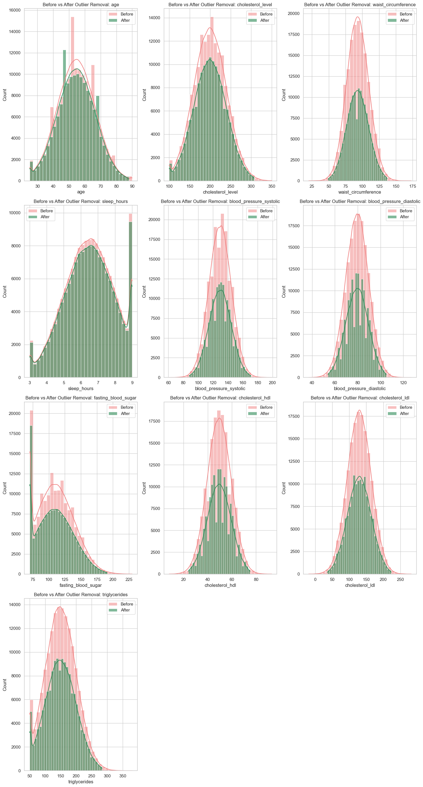

# Laporan Proyek Machine Learning - Muhammad Rizky Asyam Haidar

## Domain Proyek : Kesehatan (Penyakit Jantung)


Penyakit jantung merupakan penyebab kematian tertinggi di Indonesia. Salah satu bentuk serius dari penyakit ini adalah serangan jantung (heart attack), yang sering kali tidak terdeteksi sejak dini. Dalam konteks layanan kesehatan masyarakat, kemampuan untuk memprediksi risiko serangan jantung berdasarkan data medis dan gaya hidup dapat memberikan intervensi lebih awal dan mengurangi angka kematian.


Menurut laporan WHO dan Kementerian Kesehatan RI, faktor risiko seperti hipertensi, kolesterol tinggi, kebiasaan merokok, obesitas, serta gaya hidup tidak sehat sangat berkontribusi terhadap penyakit kardiovaskular.


## Referensi:
- Kementerian Kesehatan RI, "Situasi Penyakit Jantung di Indonesia", 2018.
- WHO, Cardiovascular Diseases (CVDs), 2021.

## Business Understanding

### Problem Statements

- **PS1** Bagaimana cara memprediksi kemungkinan serangan jantung berdasarkan data kesehatan individu?
- **PS2** Algoritma machine learning mana yang paling efektif untuk mengklasifikasikan risiko serangan jantung dalam dataset ini?

### Goals

- **G1** Membangun model prediksi risiko serangan jantung dengan akurasi dan performa metrik yang layak.
- **G2** Membandingkan performa beberapa algoritma machine learning dalam mengklasifikasikan risiko tersebut.

    ### Solution statements
    - Menerapkan empat algoritma klasifikasi: Logistic Regression, Support Vector Machine (SVM), K-Nearest Neighbors (KNN), dan XGBoost.
    - Melakukan balancing pada kelas target menggunakan `class_weight='balanced'` untuk Logistic Regression.
    - Mengevaluasi performa dengan metrik: accuracy, precision, recall, dan F1-score.

## Data Understanding
- **Link Dataset**: <https://www.kaggle.com/datasets/ankushpanday2/heart-attack-prediction-in-indonesia>  

### Variabel-variabel pada Heart Attack Prediction Indonesia dataset adalah sebagai berikut:
- **age**: Usia responden (dalam tahun).
- **gender**: Jenis kelamin responden (`Male`/`Female`).
- **region**: Wilayah tempat tinggal responden.
- **income_level**: Tingkat pendapatan responden (`Low`, `Medium`, `High`).
- **hypertension**: Riwayat hipertensi (1 = ya, 0 = tidak).
- **diabetes**: Riwayat diabetes (1 = ya, 0 = tidak).
- **cholesterol_level**: Tingkat kolesterol total (numerik).
- **obesity**: Status obesitas (1 = obesitas, 0 = tidak).
- **waist_circumference**: Lingkar pinggang (dalam cm).
- **family_history**: Riwayat keluarga dengan penyakit jantung (1 = ada, 0 = tidak).
- **smoking_status**: Status merokok (`Never`, `Former`, `Current`).
- **alcohol_consumption**: Konsumsi alkohol (`Yes`/`No`).
- **physical_activity**: Aktivitas fisik reguler (`Yes`/`No`).
- **dietary_habits**: Pola makan sehat (`Healthy`, `Unhealthy`).
- **air_pollution_exposure**: Tingkat paparan polusi udara (`Low`, `Moderate`, `High`).
- **stress_level**: Tingkat stres responden (`Low`, `Moderate`, `High`).
- **sleep_hours**: Rata-rata jam tidur per malam (dalam jam).
- **blood_pressure_systolic**: Tekanan darah sistolik (mmHg).
- **blood_pressure_diastolic**: Tekanan darah diastolik (mmHg).
- **fasting_blood_sugar**: Kadar gula darah puasa (mg/dL).
- **cholesterol_hdl**: Kadar kolesterol HDL (mg/dL).
- **cholesterol_ldl**: Kadar kolesterol LDL (mg/dL).
- **triglycerides**: Kadar trigliserida (mg/dL).
- **EKG_results**: Hasil pemeriksaan EKG (`Normal`, `Abnormal`, `Borderline`).
- **previous_heart_disease**: Riwayat penyakit jantung sebelumnya (1 = ya, 0 = tidak).
- **medication_usage**: Konsumsi obat terkait jantung (1 = ya, 0 = tidak).
- **participated_in_free_screening**: Partisipasi dalam skrining gratis (1 = ya, 0 = tidak).
- **heart_attack**: Target variabel: apakah pernah mengalami serangan jantung (1 = ya, 0 = tidak).

### Drop Column yang tidak penting
```python
df = df.drop(['region', 'income_level', 'family_history', 'alcohol_consumption', 'EKG_results', 'participated_in_free_screening'], axis=1)
```
Sehingga data tersisa seperti berikut

- **age**: umur responden
- **gender**: jenis kelamin
- **smoking_status**: status merokok
- **physical_activity**: tingkat aktivitas fisik
- **dietary_habits**: kebiasaan pola makan
- **air_pollution_exposure**: tingkat paparan polusi udara
- **stress_level**: tingkat stres
- **blood_pressure_systolic** / **diastolic**
- **cholesterol_level**, **HDL**, **LDL**, **triglycerides**
- **fasting_blood_sugar**, **waist_circumference**
- **hypertension**, **diabetes**, **obesity**, **previous_heart_disease**, **medication_usage**
- **heart_attack**: target klasifikasi (0 = tidak, 1 = ya)

### Kondisi Data
- **Jumlah Sampel Data** = 158355 

### Exploratory Data Analysis (EDA) Missing Values & Outliers
- **Missing Values** = Tidak ada missing values (0)
- **Pembagian Data** : Data dibagi menjadi 2 jenis yaitu numeric_features dan categorical_features
- **Deteksi Outliers Numeric Features dengan IQR** : 
   
   - Grafik ini membandingkan distribusi fitur numerik sebelum (warna merah muda) dan sesudah (warna hijau) penghapusan outlier. Penghapusan outlier bertujuan untuk memperbaiki distribusi data dan menghindari pengaruh negatif nilai ekstrem terhadap model.

- **After Penghapusan Outliers** :
   

- **Analisis Per Fitur** :
   - **`age`**: Distribusi usia menunjukkan beberapa nilai ekstrem di atas 85 tahun yang dikategorikan sebagai outlier. Setelah dihapus, distribusi menjadi lebih simetris.
  
   - **`cholesterol_level`**, **`cholesterol_hdl`**, **`cholesterol_ldl`**: Masing-masing menunjukkan distribusi mendekati normal, namun memiliki beberapa nilai sangat tinggi. Penghapusan outlier memperhalus kurva distribusi.
  
   - **`waist_circumference`**: Beberapa nilai sangat rendah atau sangat tinggi dikategorikan sebagai outlier. Setelah dihapus, data lebih terkonsentrasi di tengah distribusi.

   - **`sleep_hours`**: Terdapat lonjakan tidak wajar pada jam tidur ekstrem (misalnya > 9 jam). Setelah penghapusan, distribusi menjadi lebih wajar.

   - **`blood_pressure_systolic` & `blood_pressure_diastolic`**: Keduanya menunjukkan distribusi normal dengan sedikit outlier ekstrem di bawah/atas ambang klinis.

   - **`fasting_blood_sugar`**: Menampilkan distribusi skewed kanan, dengan banyak outlier di atas 160 mg/dL. Setelah penghapusan, distribusi menjadi lebih ramping.

   - **`triglycerides`**: Outlier yang sangat tinggi mempengaruhi bentuk distribusi. Setelah dibersihkan, histogram menjadi lebih simetris.

### Exploratory Data Analysis (EDA) Univariate
- **Distribusi Variabel Kategorikal** : 
   
   - **gender** : Distribusi gender relatif seimbang antara pria dan wanita.
   - **smoking_status** : Mayoritas responden adalah yang tidak pernah merokok dan Diikuti oleh perokok saat ini dan mantan perokok.
   - **physical_activity** : Sebagian besar individu memiliki aktivitas fisik sedang dan rendah dan Aktivitas fisik tinggi hanya mencakup sebagian kecil responden.
   - **dietary_habits** : Sebagian besar responden memiliki kebiasaan makan yang tidak sehat.
   - **air_pollution_exposure** : Paparan polusi udara sedang paling dominan, diikuti oleh rendah dan tinggi.
   - **stress_level** : Mayoritas memiliki tingkat stres sedang.dan Tingkat stres rendah dan tinggi lebih sedikit.
   - **hypertension, diabetes, obesity, previous_heart_disease, medication_usage** : Sebagian besar responden tidak memiliki kondisi tersebut (label `0`). dan Rasio yang memiliki kondisi (`1`) relatif kecil, menunjukkan imbalance data.
- **Distribusi Variabel Numerical** : 
   
   - **age** : Distribusi usia menyerupai distribusi normal dengan puncak sekitar usia 60 tahun.
   - **cholesterol_level** : Distribusi simetris dengan puncak di sekitar 200 mg/dL.
   - **waist_circumference** : Bentuk distribusi normal dengan rata-rata sekitar 90–100 cm.
   - **sleep_hours** : Distribusi tidak normal. dan Mayoritas tidur antara 6–8 jam, ada lonjakan pada 9 jam.
   - **blood_pressure_systolic` dan `blood_pressure_diastolic**: Kedua variabel memiliki distribusi mendekati normal. dan Tekanan sistolik rata-rata di sekitar 130 mmHg dan diastolik sekitar 80 mmHg.
   - **fasting_blood_sugar** : Distribusi skewed ke kanan (positif). Konsentrasi utama antara 90–120 mg/dL.
   - **cholesterol_hdl`, `cholesterol_ldl** : Distribusi cenderung normal. HDL sekitar 50 mg/dL, LDL sekitar 130 mg/dL.
   - **triglycerides**
    Distribusi agak skewed ke kanan. dan Nilai trigliserida kebanyakan di bawah 200 mg/dL.

### Exploratory Data Analysis (EDA) Multivariate
- **Distribusi Serangan Jantung Berdasarkan Fitur Kategorikal**
   
   - **Gender**  : Laki-laki memiliki jumlah kasus serangan jantung yang sedikit lebih tinggi dibanding perempuan.   Ini mengindikasikan gender berpotensi menjadi faktor risiko.
   - **Smoking Status**  : Individu yang merokok (current) memiliki proporsi serangan jantung yang lebih tinggi.   Namun, jumlah terbesar berasal dari kelompok tidak merokok (never), mengindikasikan ada faktor lain yang juga berpengaruh.
   - **Physical Activity**  : Tingkat aktivitas tinggi cenderung terkait dengan lebih sedikit kasus serangan jantung.   Sebaliknya, aktivitas rendah memiliki proporsi serangan jantung lebih tinggi.
   - **Dietary Habits**  : Pola makan tidak sehat (Unhealthy) berkorelasi dengan lebih banyak kasus serangan jantung.   Diet sehat (Healthy) tampaknya menjadi faktor protektif.
   - **Air Pollution Exposure**  : Paparan polusi tinggi berkaitan dengan lebih banyak kasus serangan jantung dibanding paparan rendah. 
   - **Stress Level**  : Stres tinggi berhubungan erat dengan frekuensi serangan jantung yang lebih tinggi.  Hal ini menunjukkan pentingnya faktor psikologis.
   - **Hypertension**  : Penderita hipertensi secara signifikan memiliki lebih banyak kasus serangan jantung.
   - **Diabetes**  : Penderita diabetes juga menunjukkan kecenderungan lebih tinggi mengalami serangan jantung.
   - **Obesity** :  Kasus serangan jantung lebih banyak terjadi pada individu dengan obesitas.
   - **Previous Heart Disease** : Riwayat penyakit jantung sebelumnya adalah indikator kuat terhadap serangan jantung berulang.
   - **Medication Usage** : Penggunaan obat memiliki jumlah kasus serangan jantung yang relatif tinggi, menandakan pasien berisiko tinggi sedang diobati.
- **Korelasi Fitur Numeric** :
   
   - Tidak ada korelasi tinggi antar fitur numerik, yang terlihat dari nilai korelasi mendekati 0.
   - Korelasi tertinggi terjadi antara:
      - blood_pressure_systolic dan blood_pressure_diastolic: ~0.5
      - cholesterol_level dan cholesterol_ldl: ~0.4
   - Sebagian besar fitur berdistribusi independen, artinya masing-masing bisa menyumbang informasi unik ke dalam model prediksi.

## Data Preparation
**Mengapa Diperlukan Data Preparation** :
- Kualitas Data Mempengaruhi Hasil Model
- Beberapa algoritma membutuhkan data dalam format numerik dan berskala.
- Menyeimbangkan Data (Handling Imbalance)
- Meningkatkan Performa dan Akurasi Model

**One Hot Encoding**
- Melakukan one hot encoding pada data categorical dengan code berikut
```python
# Buat encoder
ohe = OneHotEncoder(drop='first', sparse_output=False)

# Encode fitur kategorikal
encoded_cat = ohe.fit_transform(df[categorical_features])
encoded_cat_df = pd.DataFrame(encoded_cat, columns=ohe.get_feature_names_out(categorical_features), index=df.index)

encoded_cat_df.head()
```
| gender_Male | smoking_status_Never | smoking_status_Past | physical_activity_Low | physical_activity_Moderate | dietary_habits_Unhealthy | air_pollution_exposure_Low | air_pollution_exposure_Moderate | stress_level_Low | stress_level_Moderate | hypertension_1 | diabetes_1 | obesity_1 | previous_heart_disease_1 | medication_usage_1 |
|-------------|----------------------|----------------------|------------------------|-----------------------------|--------------------------|----------------------------|-------------------------------|-------------------|------------------------|----------------|-------------|------------|--------------------------|---------------------|
| 1.0         | 1.0                  | 0.0                  | 0.0                    | 0.0                         | 1.0                      | 0.0                        | 1.0                           | 0.0               | 1.0                    | 0.0            | 1.0         | 0.0        | 0.0                      | 0.0                 |
| 0.0         | 0.0                  | 1.0                  | 0.0                    | 1.0                         | 0.0                      | 0.0                        | 0.0                           | 0.0               | 0.0                    | 0.0            | 0.0         | 0.0        | 1.0                      | 0.0                 |
| 0.0         | 0.0                  | 1.0                  | 0.0                    | 1.0                         | 0.0                      | 1.0                        | 0.0                           | 1.0               | 0.0                    | 0.0            | 0.0         | 1.0        | 0.0                      | 1.0                 |
| 1.0         | 1.0                  | 0.0                  | 0.0                    | 1.0                         | 1.0                      | 1.0                        | 0.0                           | 0.0               | 0.0                    | 1.0            | 0.0         | 0.0        | 0.0                      | 1.0                 |
| 1.0         | 0.0                  | 0.0                  | 0.0                    | 1.0                         | 1.0                      | 0.0                        | 0.0                           | 0.0               | 1.0                    | 1.0            | 0.0         | 0.0        | 1.0                      | 0.0                 |

**Train Data with Scaler** : 
```python
X_raw = pd.concat([df[numeric_features], encoded_cat_df], axis=1)
y = df['heart_attack'].astype(int)

X_train_raw, X_test_raw, y_train, y_test = train_test_split(
    X_raw, y, test_size=0.2, random_state=42, stratify=y

scaler = StandardScaler()
X_train = scaler.fit_transform(X_train_raw)
X_test = scaler.transform(X_test_raw)
)
```
- Fitur kategorikal seperti gender, smoking_status, dll. diubah menjadi numerik dengan teknik One-Hot Encoding, sambil menghindari dummy trap (drop='first').
- Hasil encoding ini kemudian digabung dengan fitur numerik lain seperti age, blood_pressure, dll.
- Seluruh data numerik (gabungan fitur asli dan hasil encoding) diskalakan menggunakan StandardScaler agar semua fitur memiliki mean 0 dan standar deviasi 1.
- Ini penting karena PCA sensitif terhadap skala data.

**PCA** :
- PCA dilakukan pada data hasil scaling, khususnya hanya pada data training.
- Tujuannya adalah mereduksi dimensi data menjadi hanya 2 komponen utama (PCA1 dan PCA2) yang menangkap variansi terbesar dari data asli.
- Hasil transformasi ini membentuk X_pca.
```python
# PCA pada data training (bisa juga pada gabungan train+test kalau hanya untuk visualisasi)
pca = PCA(n_components=2)
X_pca = pca.fit_transform(X_train)

# Buat dataframe untuk plot
pca_df = pd.DataFrame(data=X_pca, columns=['PCA1', 'PCA2'])
pca_df['heart_attack'] = y_train.values

# Pairplot
sns.pairplot(pca_df, hue='heart_attack', palette='Set1')
plt.suptitle("PCA Pairplot (2 Komponen Utama)", y=1.02)
plt.show()
```


## Modeling
Empat model klasifikasi diterapkan:

Empat model klasifikasi telah diterapkan untuk memprediksi serangan jantung. Berikut ringkasan kinerjanya:

1. **Logistic Regression** (`class_weight='balanced'`)
   - Precision (positif): 0.40
   - Recall (positif): 0.58
   - F1-score: 0.48
   - Akurasi: **48.6%**
   - Model mampu mengimbangi distribusi kelas, namun akurasi keseluruhan masih rendah.

2. **Support Vector Machine**
   - Precision (positif): 0.00
   - Recall (positif): 0.00
   - F1-score: 0.00
   - Akurasi: **59.9%**
   - Meskipun akurasi cukup tinggi, model gagal total dalam mengidentifikasi kasus serangan jantung (kelas positif), sehingga tidak dapat diandalkan secara prediktif.

3. **K-Nearest Neighbors**
   - Precision (positif): 0.67
   - Recall (positif): 0.55
   - F1-score: 0.60
   - Akurasi: **71.1%**
   - Model dengan keseimbangan terbaik antara presisi dan recall. Performa keseluruhan paling stabil.

4. **XGBoost Classifier**
   - Precision (positif): 0.70
   - Recall (positif): 0.14
   - F1-score: 0.23
   - Akurasi: **63.0%**
   - Precision tinggi namun recall sangat rendah, artinya model sering salah mengklasifikasikan kasus positif.


**Model Terbaik:**  
K-Nearest Neighbors** menunjukkan trade-off terbaik antara precision dan recall, serta memberikan akurasi tertinggi di antara semua model. Ini menjadikannya pilihan paling optimal dalam konteks dataset ini.

## Evaluation
### Metrik yang Digunakan

- **Accuracy**: proporsi prediksi benar
- **Precision**: ketepatan model memprediksi kelas 1
- **Recall**: kemampuan model mendeteksi kelas 1
- **F1-score**: harmonisasi precision dan recall

### Hasil Evaluasi Model

| Model               | Accuracy | Precision (1) | Recall (1) | F1-score (1) |
|---------------------|----------|----------------|------------|--------------|
| Logistic Regression | 0.4862   | 0.40           | 0.58       | 0.48         |
| SVM                 | 0.5990   | 0.00           | 0.00       | 0.00         |
| KNN                 | 0.7110   | 0.67           | 0.55       | 0.60         |
| XGBoost             | 0.6303   | 0.70           | 0.14       | 0.23         |

**Formula**
- Accuracy = TP + TN / TP + TN + FP + FN
​- Precision= 𝑇𝑃 / 𝑇𝑃 + 𝐹𝑃
​- Recall= TP / TP + FN
- F1-score=2 × Precision×Recall / Precision+Recall


**---Ini adalah bagian akhir laporan---**

